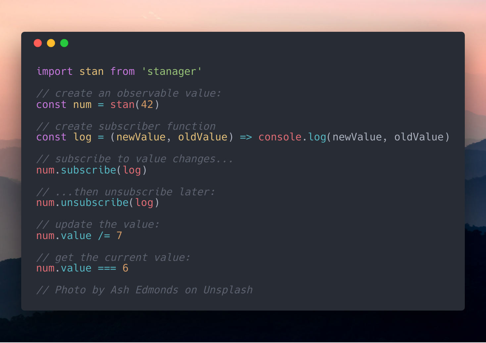

<h1 align=center> 👩‍💼 Stanager (stan) </h1>
<p align=center><em>Stanager is an immutable state manager with subscribe and unsubscribe features based on https://git.io/Valoo</em></p>


## Installation

```bash
npm i stanager
```

## Usage

```js
const stan = require('stanager')
// or
import stan from 'stanager'

// create an observable value:
const shoppingCart = stan(['bread'])

// assign new value:
shoppingCart.value = shoppingCart.value.concat(['meatballs', 'flat bread'])

// create listener function:
const changeLogger = (newCart, oldCart) => {
  const changes = {
    removed: oldCart.filter(item => newCart.indexOf(item) === -1),
    added: newCart.filter(item => oldCart.indexOf(item) === -1),
  }
  
  changes.removed.forEach(item => console.log(`removed: '${item}'`))
  changes.added.forEach(item => console.log(`added: '${item}'`))
}

// subscribe to changes:
shoppingCart.subscribe(changeLogger)

// invoke listener(s):
shoppingCart.value = shoppingCart.value.filter(item => item.indexOf('bread') === -1).concat('marinara sauce')

/* output:

removed: 'bread'
removed: 'flat bread'
added: 'marinara sauce'

*/

// get current value:
shoppingCart.value

// output: 
```

## How it works:

When you run `stan(value)` it returns an object with four methods:

```js
{
  subscribe(...) {...},
  unsubscribe(...) {...},
  get value() {...},
  set value(...) {...},
}
```

You can use these four methods to _listen_, and _unlisten_ to value changes, and to _set/get_ the value, as per their names. However, you __cannot__ mutate the data... well you can, but it's hidden behind `Symbol('value')` and the listeners are hidden behind `Symbol('subscriberList')`. So, via normal means, it is impossible to mutate data, even arrays and objects are recursively copied to disallow mutation of any sort.